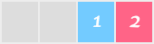
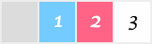
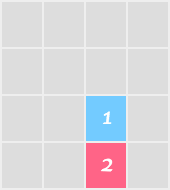

# threes-1k

##### Play the game here: https://js1k.com/2014-dragons/demo/1667

[JS1K][js1k] was an annual event running from 2010-2019 in which JS developers attempt to build something interesting with 1024 or fewer bytes of javascript.

My [Honorably-Mentioned][hm] 2014 entry, [`threes-1k`][demo], was an interpretation of the brilliant, beautifully simple puzzle game [Threes][threes].

I say "interpretation" rather than "clone" because it’s missing the nuance that makes Threes such a beautiful, captivating game; but it replicates the basic gameplay. The real game [famously took over a year][threemails] to get right. I was hoping to finish it in a weekend- and in less than 1024 bytes of JavaScript.

I've included both the sub-1k, [minified version][min] of the code along with the (somewhat) human readable [un-minified version][unmin] of the code.

I used one of my favorite tools, [JSFiddle][jsfiddle], as an editor. I created a fiddle that had the JS1K boilerplate already loaded, so I could just work in the JavaScript section. While not as full-featured as a normal editor, I was able to iterate very quickly. I could make a quick change, click "Run", and have the changes I made show up immediately without even reloading the browser.

The first pass didn’t take much time, I mostly knocked it out in one evening. The thing that took the most time was the algorithm that controls how the tiles can move.

Threes is a sliding tile puzzle. The game field is 4x4 and starts with a random assortment of tiles. Each tile has a number (and a cute character animation on the mobile version). On each turn, the user slides the tiles by one. On a mobile device, the user swipes in a direction to move the tiles. In this adaptation, the user presses an arrow key to slide the tiles. Tiles can move in a direction if there is a blank space for it to move into, or if two tiles in the row can "squish". When there are no moves left, the game ends.

Let's pull apart the possible legal moves:

If the user presses "left", the game looks for the first blank space, and all of the tiles to the right of the blank are moved left.

|  |
| :---------------------------------------------------------------------------------------------------------------------------------------------------------------------------------------------------------: |
|                                                              When the user presses the left arrow key, the tiles move left- into blank spaces.                                                              |

If there are no more blank spaces, we check to see if any tiles can be "squished". A 1 and 2 can squish to make a 3. Higher numbers can only squish if they're equal- summing their values.

|  |
| :---------------------------------------------------------------------------------------------------------------------------------------------------------------------------------------------------------------------------------------------------------: |
|                                                                                When there are no more blank spaces, matching tiles "squish" and numbers are added together.                                                                                 |

These actions can happen in any cardinal direction.

I stored the game field in an array of arrays, storing either the tile's value or a `0` for a blank space. To perform a squish, we step through each value in the array. If we find a blank space, we [.splice()][splice] it out. The remaining values snap into place in the array, and we add a 0 at the end to maintain the length of the row:

```javascript
// v is our current row. It has a blank space in position 0:
var v = [0, 1, 2, 3];
for (var m = 0; m < 4) {
  if (v[m] === 0) {
    v.splice(m, 1);
    v[3] = 0;
    break;
  }
}
```

(I later had to add some code to make sure that this only happened if there were non-blank tiles to the right, but I left it out here for simplicity.)

Another check compares the current value with the next value in the array. If they matched, or they added up to 3, `.splice()` once again comes into play:

```javascript
var v = [0, 1, 2, 3];
for (var m = 0; m < 4) {
  // ... squish zeros ...
  var n = m + 1;
  if ((v[m] >= 3 && v[m] == v[n]) || v[m] + v[n] == 3) {
    v[i].splice(m, 2, v[m] + v[n]);
    v[3] = 0;
  }
}
```

We already know that `v[m]` isn’t a blank space, because we would’ve squished and ended the loop. This code checks to see if each value either sums to 3 (meaning we have exactly 1 “1” and 1 “2” tiles) or that this value is at least a 3 and identical to the next value. If we find that we have a match, we remove this value and the next value, and use the argument to insert the sum of the matched tiles.

At this point I had a general solution for sliding left, but Threes allows you to slide in four directions. A modification of my `array.splice()` solution might have worked for squishing right, but up and down would probably have required completely different code because it would be comparing across four arrays rather than just within the same array. Four cases would have been a lot of code, so instead I tried to find a way to only use the code I’d already written.

I realized that If I wanted to squish up, I could simply rotate the board counterclockwise 90° and squish left. If I then rotate the board 90° three more times, the tiles would return their former positions (except, of course, for whatever tiles were squished). To save space I just wrote a function that rotated the game field 4 times no matter what, each time checking to see if the squish needed to be performed.

|  |
| :----------------------------------------------------------------------------------------------------------------------------------------------------------------------------------------------------------------: |
|                                                    Squishing down rotates counterclockwise three times, performs a leftward squish, and rotates one final time.                                                    |

Squishing down rotates counterclockwise three times, performs a leftward squish, and rotates one final time.
Now that I could perform a squish in any direction, I needed to offer that control to the user through the arrow keys. Luckily, the `event.which` values for left, up, right, and down are 37, 38, 39, and 40 respectively. I could simply subtract 36 from the keycode to find out which rotation to squish on, which made the operation incredibly easy (and more importantly, code-economical). If the user presses “down”, a “4” tells the code to perform 3 rotations, squish, and then perform one more rotation to bring the tiles back to their original position. If the user presses left, a “1” tells the code to squish immediately, and then perform 4 (useless, but computationally cheap) rotations.

> `event.which` is deprecated and apparently platform-dependant, but it seemed to work on every platform I tried. This may have changed since 2014.

To see if the user has any moves left, I added another feature to the “operate” function. If I passed a 0, rather than a 1-4, no squish would be performed- but on each rotation, it would run through the squish logic to see if a squish was possible. If no squishes are possible in any direction, then there are no moves remaining, and the game is over. I found [a forum post][scoring] where someone figured out the scoring algorithm, so I added accurate scorekeeping just to make the game that much more authentic.

In contrast to the similar game [2048], a new game of Threes starts with several random tiles on the board. I wanted to be sure to capture this detail, so I started several games of Threes and made note of what the initial board looked like. I observed that there were always 9 tiles with a healthy mix of tile values. I guessed that instead of purely random tiles, Threes was using a [bag-style tile drawing algorithm][bag]. (My hunch was right, the [Threes emails][threemails] discuss their bag usage.) I didn’t even try to fit this in 1024 bytes. Instead, I cheated a little: I decided that each new game would have two 3s, one 2, two 1s, and three randomly-drawn tiles. This felt pretty good, you were virtually guaranteed to have several available moves right off the bat.

Drawing tiles completely at random was a difficult sacrifice to make. You sometimes get the same tile several turns in a row, which _really_ hurts gameplay. If I suddenly had 100 more bytes to work with, this is probably the first thing I’d try to improve.

I ended up using my “Draw a tile” function in a few different ways to save space. Initially, it simply returns a 1, 2, or 3 tile at random. This lets us add a little randomness to the board’s initial state.

```javascript
g = Math.ceil(Math.random() * 3);
```

As you play, a new tile with a random value is added every turn. Classic Threes usually gives you a 1, 2, or 3; but sometimes you get lucky and pull a higher tile- up to the highest tile that's already on the board. I added this behavior to my draw method by keeping track of the highest tile on the board and- if a 3 was rolled- sometimes doubling the value, up to the highest value on the board. I wasn’t sure if I weighted it correctly, but it seemed to work fairly well.

```javascript
// H stores the highest value on the board
while (g > 2 && g < H && Math.random() < 0.4) {
  g *= 2;
}
```

Finally, I needed a way to shuffle the initial start state. To save space, I decided to abuse [array.sort()][sort]. By passing sort() a comparator function that randomly returns a positive or negative value, you can achieve a kind-of-but-not-really random sort. To avoid the overhead of writing a new function that returned a usable random value, I decided to re-use the random tile generator. Usually I called it with no argument, but since sort() always passes two arguments, I could look for an argument and, if one is present, subtract the result from 2 so it has a chance to be positive or negative.

```javascript
return a ? g - 2 : g;
```

To turn a single array of 16 numbers like `[3,3,2,1,1,0,0,0,0,0,0,0,1,2,3,1]` into an array of 4 arrays of 4 numbers, I once again used a feature of `array.splice()`. When you splice values out of an array, the method itself returns those values as an array. Creating our gamefield was as simple as:

```javascript
var F = [3, 3, 2, 1, 1, 0, 0, 0, 0, 0, 0, 0, 1, 2, 3, 1];
for (z = 4; z--; ) {
  F.push(F.splice(0, 4));
}
```

Note the count-down `for` loop; this saved several characters over the incrementing version.

After I had the algorithm working using `console.log`, I added code to draw the game state to the provided `<canvas>`. I also wrote the win/loss conditions, and then it was time to cut it down to size.

I changed all of the variables to single letters. I used uppercase letters for “static” values that wouldn’t change, and lowercase letters for operational variables. I also found that in many cases I could save a few characters by using global variables rather than passing values as arguments to, or returning values from, functions. Abusing JavaScript’s wacky typing also helped save some characters. To cast a number as a string, you can concatenate an empty string:

```javascript
var x = 5000;
var y = "" + x; // y is now "5000"
```

Similarly, you can turn a numeric `string` into a `Number` by making it positive:

```javascript
var x = "5000";
var y = +x;
```

(These are, of course, also great ways to shoot yourself in the foot if the value isn’t what you expect.)

Ultimately I found that while tricks to shave a few characters off here or there were useful, the most valuable savings came from discovering ways I could make a single chunk of code perform two or more tasks. I put the drawing code inside of the rotation code because they both looped over every tile in the game field, saving dozens of bytes. Using every ounce of functionality from built-in functions like splice() made a huge impact in the number of bytes used, as well.

I wish I had written a better description of how to actually play the game, because I got a bunch of feedback about it being confusing. The original game has cute animations and more intuitive controls, so it’s easier to understand what’s happening when you slide the tiles. Without the animations, it’s easy to get confused. This [1k 2048 clone][1k2048] uses the CSS transition method, and it looks great.

To really understand the code, take a look at the unminified, annotated source in [threes.js][unmin].

I used Google's closure compiler to minify the source, and hand-tuned it to cut out a few extra bytes. The [final minified source][min] weighed in at 1021 bytes, meaning I actually had 3 bytes to spare.

Both scripts rely on the JS1K bootstrap code, so the easiest way to play the game is at [the JS1K entry page][demo].

Despite writing some truly awful code I hope to never repeat in any other context I found that I learned a lot about JavaScript and programming in general by forcing myself to work in such tight margins. I enjoyed building this project so much I resolved to enter every year- but I never actually did. I did however serve as a judge for several subsequent JS1K contests.

This readme file was adapted from a 2014 blog post I wrote, which can be found [here][blog].

[js1k]: https://js1k.com/
[demo]: https://js1k.com/2014-dragons/demo/1667
[details]: https://js1k.com/2014-dragons/details/1667
[min]: threes.min.js
[unmin]: threes.js
[hm]: https://twitter.com/i/events/1452892767705726976
[threes]: http://asherv.com/threes/
[threemails]: http://asherv.com/threes/threemails/
[jsfiddle]: http://jsfiddle.net/
[splice]: https://developer.mozilla.org/en-US/docs/Web/JavaScript/Reference/Global_Objects/Array/splice
[scoring]: http://forums.toucharcade.com/showpost.php?p=3123743&postcount=38
[2048]: http://gabrielecirulli.github.io/2048/
[bag]: http://tetrisconcept.net/wiki/Playing_forever
[sort]: https://developer.mozilla.org/en-US/docs/Web/JavaScript/Reference/Global_Objects/Array/sort
[1k2048]: http://js1k.com/2014-dragons/demo/1824
[blog]: https://medium.com/@evanplus/js1k-post-mortem-38acdb25c005
